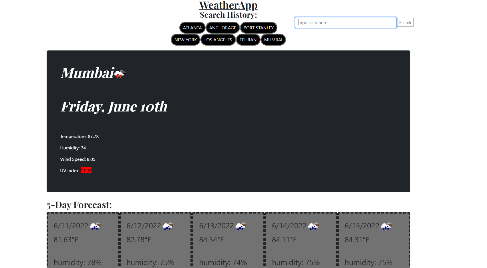

# GAB-weatherapp-C6
https://gabeab34.github.io/GAB-WeatherApp/
In this challenge I used a bootstrap blog template and repurposed it to make a webpage that uses api calls to display the current and future weather for a user inputed city. It also uses local storage to create buttons for previously searched cities so that the user can click those instead of re-inputing that city into the search bar.

